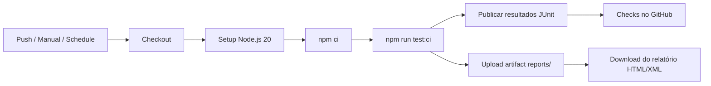

# Serviço de Pagamento — Pipeline de Integração Contínua

Projeto desenvolvido na disciplina da pós-graduação:  Um sistema  que registra pagamentos de contas e consulta o último pagamento realizado. Este repositório adiciona **testes automatizados** e uma **pipeline de integração contínua (CI)** com GitHub Actions.

## Sobre o projeto

A classe `ServicoDePagamento` expõe dois métodos principais:

| Método | Descrição |
|--------|-----------|
| `pagar(codigoBarras, empresa, valor)` | Registra um pagamento com categoria automática (`cara` se valor > 100, `padrão` caso contrário) |
| `consultarUltimoPagamento()` | Retorna o último pagamento ou `null` se não houver registros |

Os testes utilizam **Mocha** como framework e o módulo nativo **Node Assert** para asserções.

## Pré-requisitos

- [Node.js](https://nodejs.org/) 20 ou superior
- [npm](https://www.npmjs.com/)

## Como executar localmente

```bash
# Instalar dependências
npm install

# Executar testes (modo desenvolvimento)
npm test

# Executar testes no modo CI (gera relatórios em reports/)
npm run test:ci
```

Após `npm run test:ci`, os relatórios ficam disponíveis em:

- `reports/junit/test-results.xml` — formato JUnit (integração com CI)
- `reports/html/test-report.html` — relatório visual em HTML

## Pipeline de integração contínua

A pipeline está definida em [`.github/workflows/ci.yml`](.github/workflows/ci.yml) e utiliza **GitHub Actions**.

### Conceitos aplicados

#### Integração Contínua (CI)

Prática de integrar alterações de código com frequência e validá-las automaticamente. Cada execução da pipeline garante que os testes continuam passando após mudanças no repositório.

#### GitHub Actions

Plataforma de automação integrada ao GitHub. Workflows são descritos em arquivos YAML dentro de `.github/workflows/` e executados em runners (máquinas virtuais) provisionados pelo GitHub.

#### Gatilhos (triggers)

Eventos que disparam a execução da pipeline:

| Gatilho | Evento | Quando executa |
|---------|--------|----------------|
| **Push** | `push` na branch `main` | A cada commit enviado ao repositório remoto |
| **Manual** | `workflow_dispatch` | Sob demanda, pela aba **Actions** no GitHub |
| **Agendado** | `schedule` (cron) | Toda segunda-feira às 08:00 UTC (05:00 BRT) |

O agendamento periódico permite detectar problemas mesmo sem novos commits — útil para dependências externas ou regressões ambientais.

#### Jobs e steps

- **Job `testes`**: executa em `ubuntu-latest`, de forma isolada e reprodutível.
- **Steps**: checkout do código → setup do Node.js → `npm ci` → execução dos testes → publicação e armazenamento dos relatórios.

#### `npm ci` vs `npm install`

Na pipeline usa-se `npm ci`, que instala exatamente as versões do `package-lock.json`. É mais rápido e determinístico, ideal para ambientes de CI.

#### Relatório de testes

Dois formatos são gerados via [mocha-multi-reporters](https://www.npmjs.com/package/mocha-multi-reporters):

1. **JUnit XML** (`mocha-junit-reporter`) — padrão da indústria para ferramentas de CI; permite publicar resultados diretamente no GitHub.
2. **HTML** (`mochawesome`) — relatório visual com detalhes de cada teste, duração e status.

Configuração em [`.mocharc.ci.json`](.mocharc.ci.json).

#### Publicação e armazenamento do relatório

A pipeline realiza duas ações complementares:

1. **Publicação no GitHub** — a action [publish-unit-test-result-action](https://github.com/EnricoMi/publish-unit-test-result-action) lê o XML JUnit e exibe um resumo na aba **Checks** da execução.
2. **Armazenamento como artifact** — a action [upload-artifact](https://github.com/actions/upload-artifact) salva a pasta `reports/` (XML + HTML) por 30 dias. O download fica disponível na página de cada execução em **Actions → CI - Testes Automatizados → Artifacts**.

#### Permissões

O workflow declara permissões mínimas necessárias:

- `contents: read` — leitura do código
- `checks: write` — publicação dos resultados de teste
- `pull-requests: write` — comentários de resultado em PRs (quando aplicável)

### Fluxo da pipeline



## Estrutura do repositório

```
servico-de-pagamento/
├── .github/
│   └── workflows/
│       └── ci.yml              # Pipeline GitHub Actions
├── src/
│   └── ServicoDePagamento.js   # Classe de domínio
├── test/
│   └── ServicoDePagamento.test.js
├── .mocharc.ci.json            # Configuração dos reporters na CI
├── package.json
└── README.md
```

## Como disparar a pipeline manualmente

1. Acesse o repositório no GitHub.
2. Vá em **Actions**.
3. Selecione **CI - Testes Automatizados**.
4. Clique em **Run workflow** → **Run workflow**.

## Como baixar o relatório de testes

1. Abra a execução desejada em **Actions**.
2. Role até a seção **Artifacts**.
3. Baixe `relatorio-de-testes-<número>`.
4. Extraia o arquivo e abra `reports/html/test-report.html` no navegador.

## Tecnologias utilizadas

| Ferramenta | Finalidade |
|------------|------------|
| Node.js | Runtime JavaScript |
| Mocha | Framework de testes |
| Node Assert | Asserções nativas |
| mocha-junit-reporter | Relatório XML para CI |
| mochawesome | Relatório HTML |
| GitHub Actions | Orquestração da pipeline |

## Autor

Dionis Moreira — projeto da pós-graduação.
